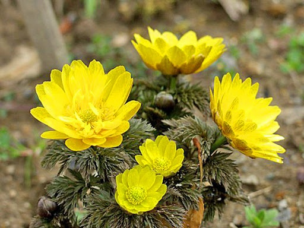

## ADONIS AMURSKY

Buttercup family - Ranunculaceae Juss.

Amur adonis is a perennial herbaceous plant 0-40 cm. Rhizome is short, thick. Stems at the beginning of flowering 5-15 cm in height, later up to 30 -40 cm, simple or slightly below

branched. Sepals glabrous or slightly pubescent, lavender; petals yellow, oblong-elliptical, obtuse at the end, 12-23 mm long and 3-8 mm wide. Fruits pubescent, 4-5 mm long, 3-3.5 mm wide, with a hook-like curved and appressed nose.

Blossoms in March-April, bears fruit in May.

It grows in the Far East (Primorye, Amur Region, Sakhalin, Kuriles, Kunashir Island). Grows in thickets of bushes, along forest edges, on moist, humus-rich soil. The aerial part of the plant is used for medicinal purposes.

The roots contain carbohydrates and a related compound adonite 0.18%, cardenolides (adonilide, fucuyusone, lineolone, 12-0-benzoylisolineolone, fucuyusonorone, isolineolone, ramanone, 12-0 (8-decoxylineolone), isoraman (8-deoxy-17-hydroxylineolone ), pergularin, esters of isoramanone and isolate.neolone (or lineolone), with benzoic and nicotinic acids, samalin, strophantidine, corhoroside A, convallatoxin, cymarin, K-strophanthin-beta, strophantidol, cymarol; coumarin, fombolethin) (orientin, homoorientin, adonivernit), In the aerial part, carbohydrates and a related compound adonit were found; cardenolides (samolin, strophantidil, corhoroside A, convallatoxin, cymarin, K-strophanthin-beta, strophantidol, cymarol, digitoxygenin), coumarins (umbelliferone, scopoletin), flavonoids (orientin, homoorientin, adonivernit).

The aboveground part of the Amur adonis is close in biological activity to that of the spring adonis (A. vernalis) and can be its substitute. The infusion of the aerial part has a sedative effect. The plant is decorative.
